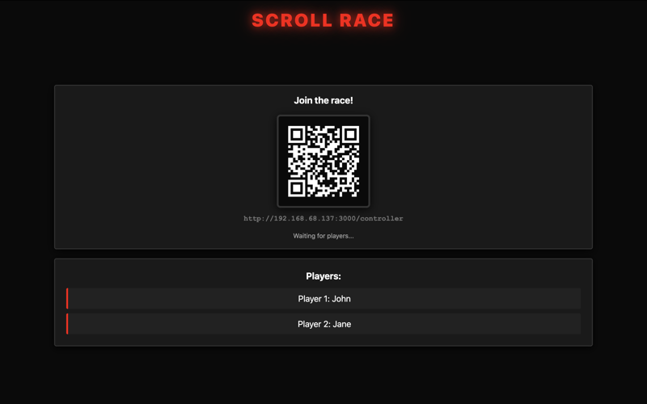
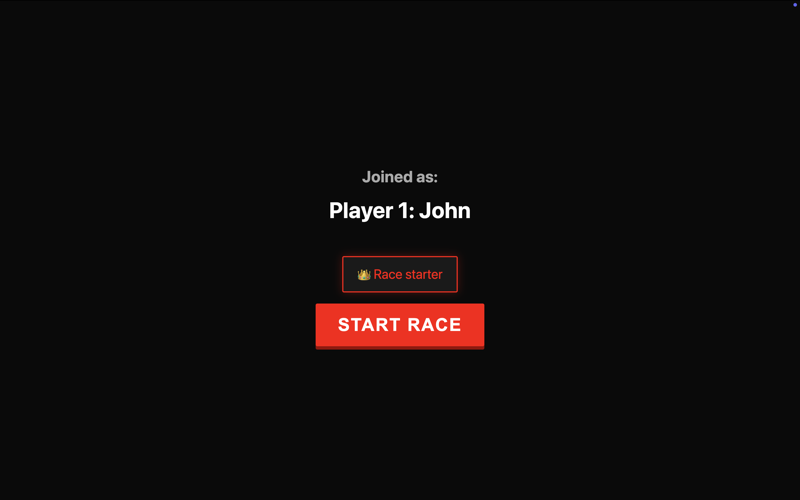
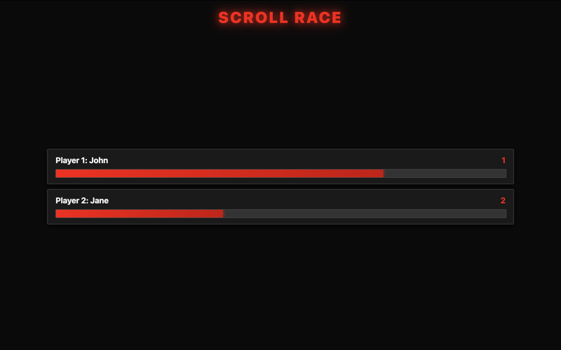
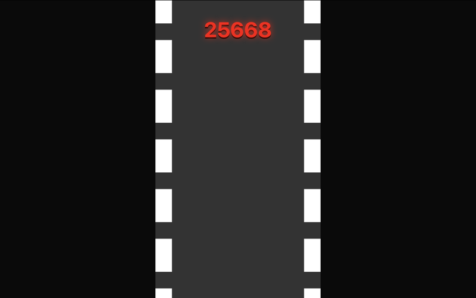
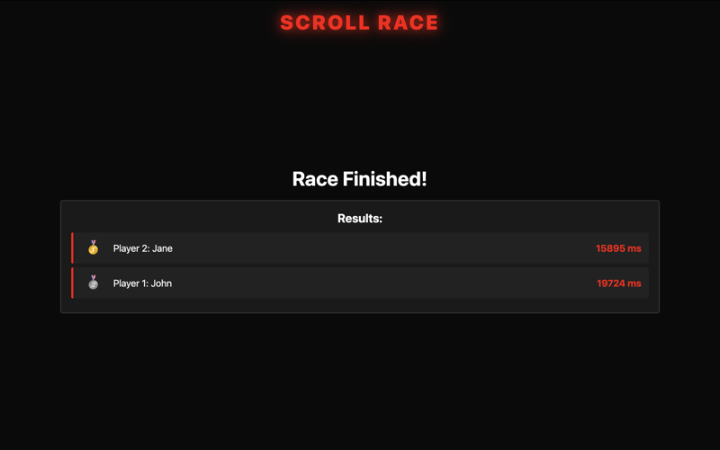
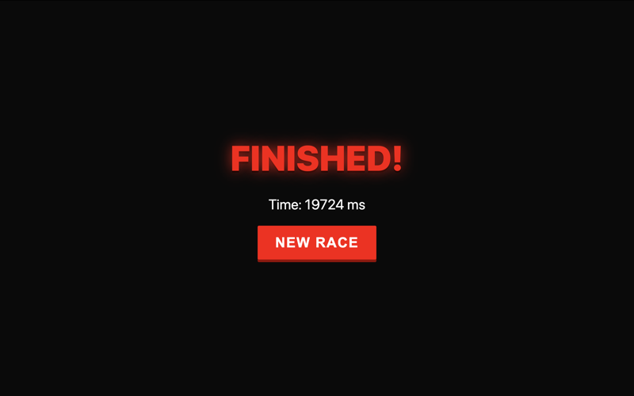

# 🏁 Scroll race

A multiplayer scroll race game where players race by scrolling on their phones. The race is displayed on a large screen.

## Screenshots

<div align="center">
  
  
  
  
  
  
</div>

## 🚀 Installation

```bash
npm install
```

## ▶️ Start

```bash
npm start
```

Server runs on `http://localhost:3000`

- **Display**: Open `http://localhost:3000` on the big screen
- **Controller**: Players scan the QR code shown on the display with their phone

## 🎮 How to play

1. Open the display on a big screen
2. Players scan the QR code with their phone
3. Choose a color and join the race
4. Scroll on your phone to race!
5. First to finish wins 🏆
